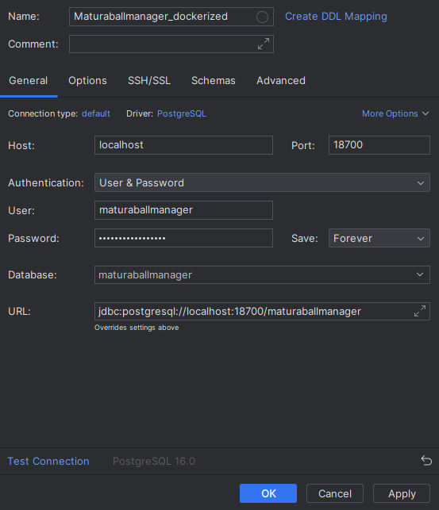
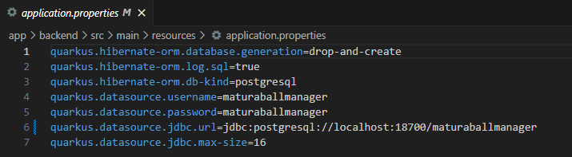

# Creating and Configuring PostgreSQL instance for development

## Content overview
- [Prerequisites](#prerequisites)
- [Install and run Docker image](#install-and-run-docker-image)
- [Connection parameters](#connection-parameters)
- [Embedding database in IntelliJ](#embedding-database-in-intellij)
- [Additional notes](#additional-notes)

## Prerequisites

* Docker (Desktop) must be installed.
* TCP port 18700 has to be open and not currently used.

## Install and run Docker image
After Docker has been downloaded to the computer, the following command must be executed via the command line:

`docker run --name mbm_db_postgres -d -p 18700:5432 tommyneumaier/mbm_db`

This command downloads and starts a Docker container called `mbm_db_postgres`, which starts up a PostgreSQL database instance and publishes it to the outside using TCP port 18700. It may take some time 

The database user created through this docker image has superuser rights and this image can therefore only be used for development and is not authorized for production.

## Connection parameters
The connection information for the database is
* Host: localhost
* Port: 18700
* User name: maturaballmanager
* Database: maturaballmanager
* Password: maturaballmanager

## Embedding database in IntelliJ
> New UI

In order to embed the database in IntelliJ Ultimate Edition, the connection information must be entered under the small database symbol on the right in the menu bar. Then click on the plus for "Add" and select the database dialect __PostgreSQL__.

Now fill in the required information as described above or in the picture below.

You can then test the connection and then add the database by confirming with "OK".

## Additional notes
* When the Quarkus server starts up, some database test entries are automatically built via the import.sql in the Java resources.
* The connection to the database is regulated in Quarkus in the application.properties. 

